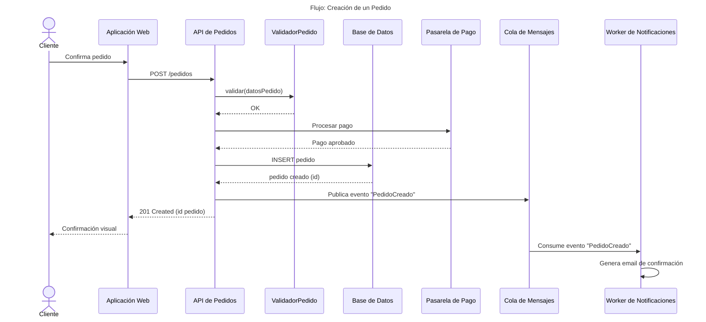
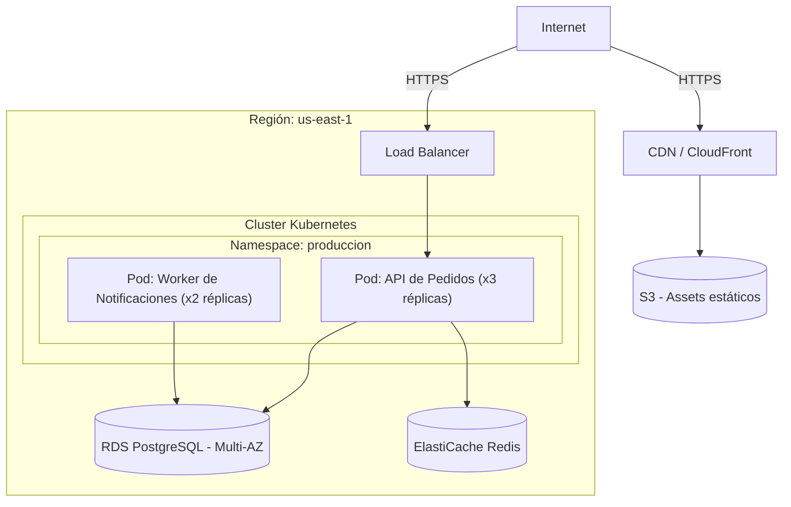
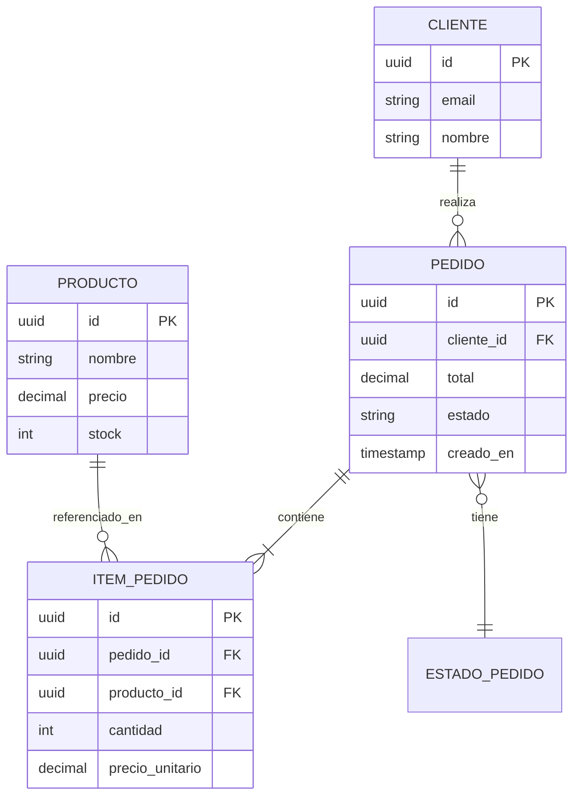

# Diagramas adicionales en Mermaid: sintaxis y ejemplos

Complementan al C4 cuando este no cubre suficiente detalle sobre un flujo, el modelo de datos o la infraestructura. Inclúyelos solo cuando aporten información nueva — no dupliques en texto lo que el diagrama ya muestra.

## Diagramas de secuencia (obligatorios para flujos críticos)

Muestran el orden temporal de interacciones entre componentes/actores para UN caso de uso concreto. Son la herramienta más efectiva para explicar "qué pasa cuando el usuario hace X" — genera uno por cada flujo de negocio crítico (autenticación, el o los casos de uso principales, cualquier flujo con pasos asíncronos o múltiples servicios).

Buenas prácticas:
- Incluye rutas alternativas o de error cuando sean relevantes al negocio (ej. pago rechazado), usando `alt`/`else` de Mermaid, en vez de crear un diagrama separado para cada variante menor.
- En Caso B (AS-IS), el diagrama debe reflejar lo que el código hace realmente, incluyendo atajos o inconsistencias — no "limpies" el flujo al documentarlo.

## Diagrama de despliegue

> **Si el proveedor de nube es AWS, Azure o GCP, no uses Mermaid para este diagrama.** Genera un archivo `.drawio` con la iconografía oficial de cada proveedor — ver `references/drawio-iconos-nube.md` (y `references/guia-multi-cloud-deployment.md` / `references/guia-terraform-a-diagrama.md` según el caso). El `graph TB` de esta sección queda solo como **fallback** para infraestructura on-premise o proveedores sin librería de iconos disponible.

Útil cuando la topología de infraestructura no es obvia: múltiples ambientes, regiones, redes, orquestación de contenedores. Se puede modelar como un grafo con `graph` o con la sintaxis `C4Deployment` si el visor la soporta; `graph TB` es más portable:

## Diagrama entidad-relación

Solo si el modelo de datos es relevante y no trivial (más de 2-3 entidades con relaciones no obvias).

## Diagrama de componentes/clases (fuera del C4 Nivel 4)

Si necesitas mostrar relaciones de herencia/composición más finas que el C4 Nivel 3, usa `classDiagram` (ver ejemplo completo en `diagramas-c4-ejemplos.md`, sección Nivel 4).

## Regla general

Cada diagrama de este archivo es condicional, a diferencia de los C4 (que siempre van niveles 1-3) y las secuencias de flujos críticos (que siempre van). Pregúntate: "¿este diagrama le dice al lector algo que el texto y los otros diagramas no le dicen ya?" Si la respuesta es no, no lo incluyas.
