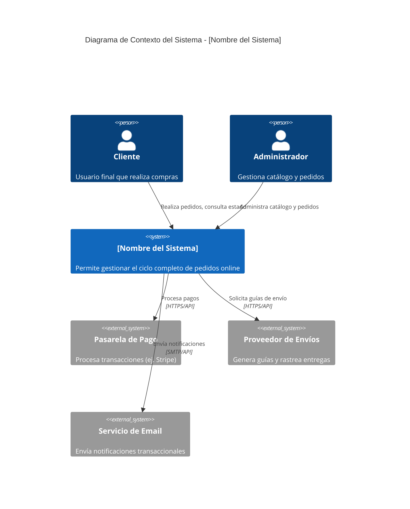
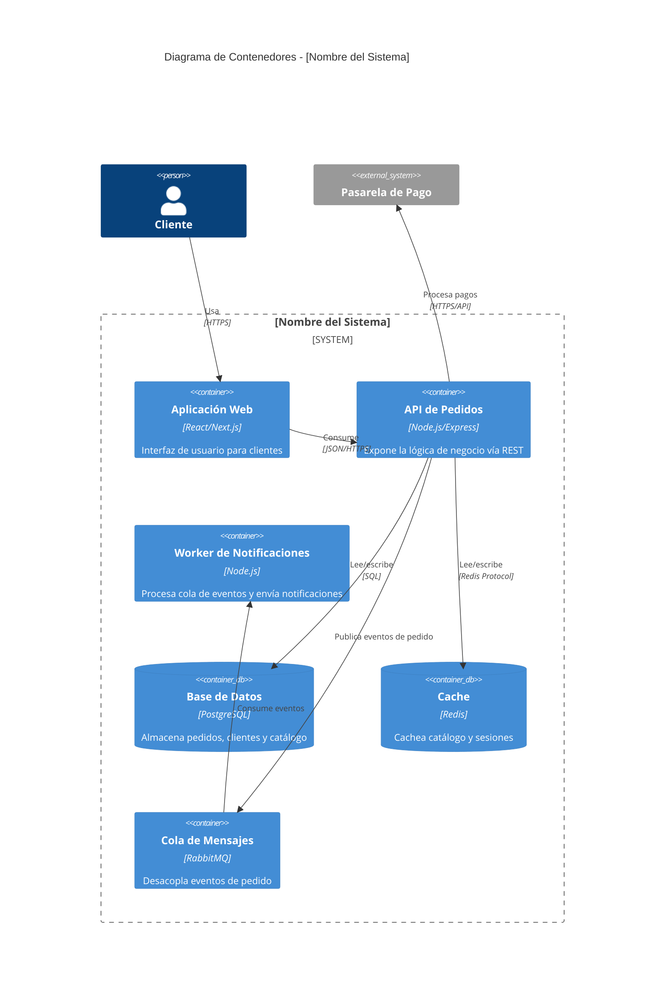
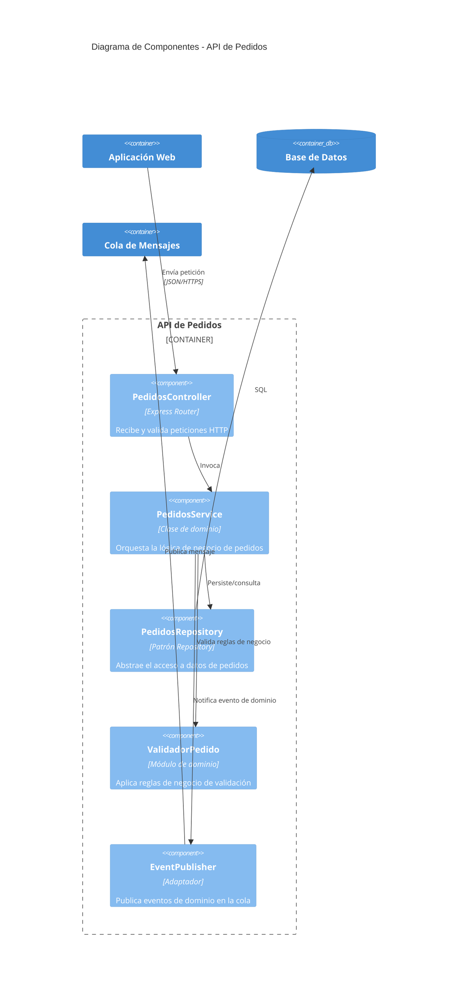
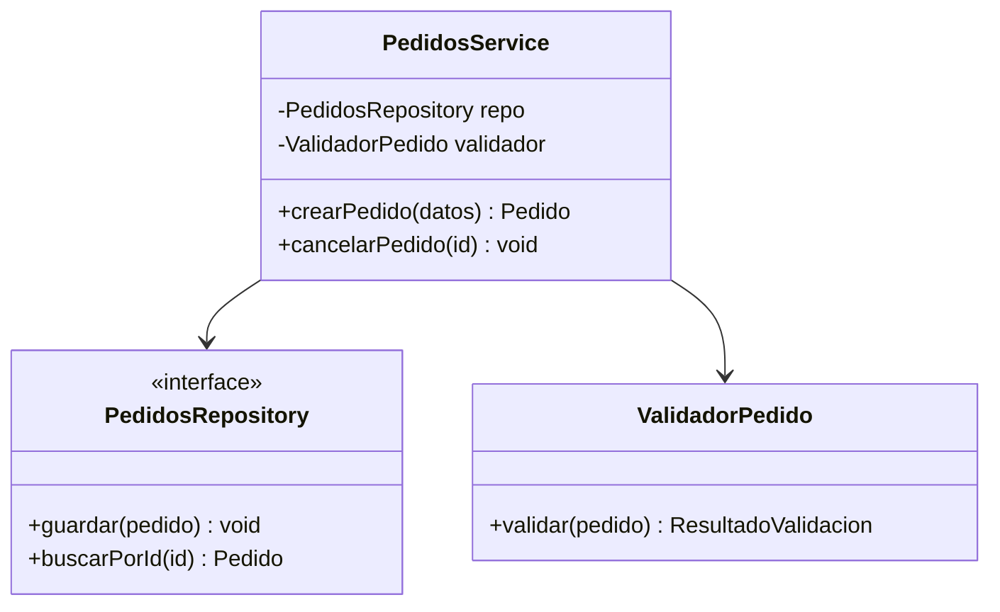

# Diagramas C4 en Mermaid: sintaxis y ejemplos

El C4 Model describe un sistema en 4 niveles de zoom creciente: Contexto → Contenedores → Componentes → Código. Genera siempre los tres primeros; el cuarto es opcional. Usa la sintaxis `C4Context`, `C4Container`, `C4Component` de Mermaid (soportada de forma nativa, se renderiza en GitHub, GitLab y la mayoría de visores de Markdown modernos).

## Nivel 1 — Diagrama de Contexto

Muestra el sistema como una caja negra y sus actores/sistemas externos. Responde: "¿con quién interactúa el sistema y para qué?"

## Nivel 2 — Diagrama de Contenedores

Abre la caja negra del sistema en las aplicaciones/servicios/bases de datos que lo componen (los "contenedores" desplegables de forma independiente).

## Nivel 3 — Diagrama de Componentes

Abre UN contenedor específico (normalmente el más complejo o crítico) en sus módulos/componentes internos y cómo colaboran. Genera uno por cada contenedor no trivial — no fuerces este nivel para contenedores simples como una base de datos administrada.

## Nivel 4 — Diagrama de Código (opcional)

Solo si el usuario lo pide o un componente es crítico/complejo. Usa un diagrama de clases estándar de Mermaid (`classDiagram`), no la sintaxis C4:

## Reglas prácticas

- Usa nombres reales del dominio/proyecto en los diagramas, nunca los genéricos de estos ejemplos.
- En Caso B (AS-IS), cada relación (`Rel`) del diagrama debe poder señalarse a una línea de código o configuración real — si no puedes verificarla, no la incluyas o márcala como supuesto.
- Mantén cada diagrama enfocado: un Nivel 2 con más de ~10 contenedores probablemente necesita agruparse (ej. por dominio/bounded context) en vez de mostrar todo de una vez.
