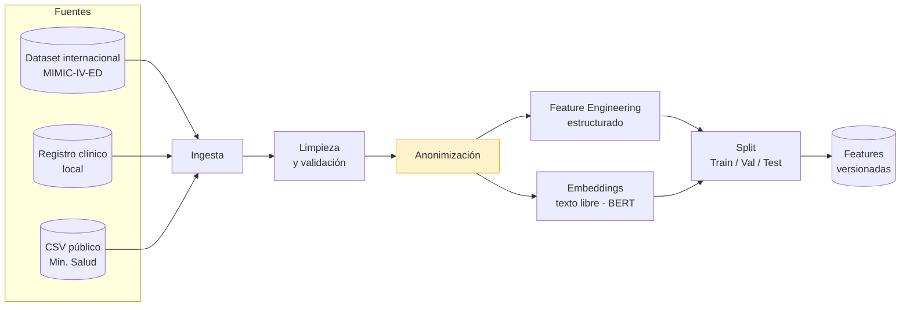
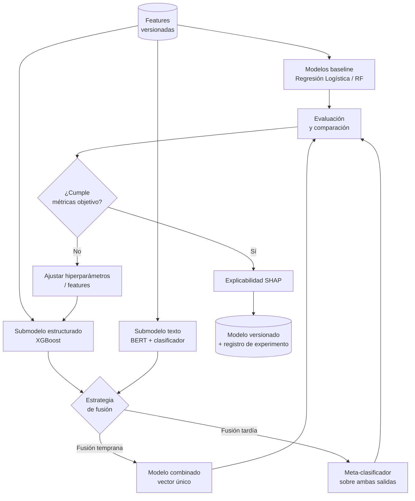
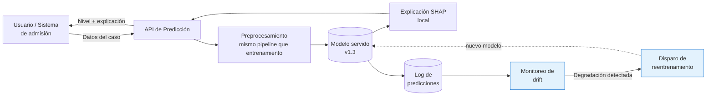
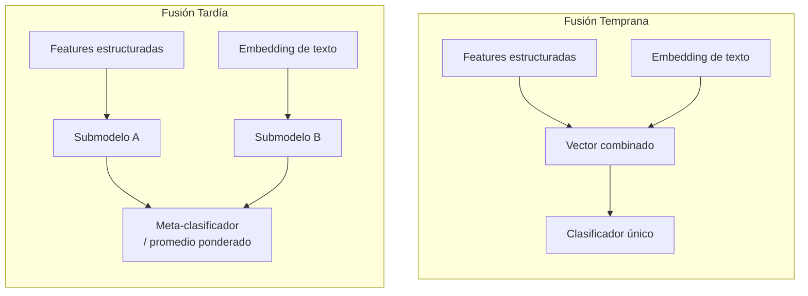

# Diagramas de Machine Learning en Mermaid: sintaxis y ejemplos

Complementan al C4 (`references/diagramas-c4-ejemplos.md`) cuando el sistema tiene un componente de ML relevante — ver `references/guia-ml-arquitectura.md` para cuándo activar este set de diagramas. Todos van embebidos como código Mermaid en el Markdown, igual que el resto del skill.

## Diagrama de Pipeline de Datos (obligatorio si hay pipeline de datos no trivial)

Muestra el recorrido de los datos desde las fuentes crudas hasta las features listas para entrenar. Usa `flowchart LR` para que se lea de izquierda a derecha como un pipeline.

Resalta con color (`style ... fill:#fff3cd`) los pasos con implicaciones de gobernanza (anonimización, manejo de datos sensibles) para que salten a la vista sin tener que leer el texto completo.

## Diagrama de Pipeline de Entrenamiento (obligatorio si el sistema entrena modelo propio)

El rombo de decisión (`{...}`) para el ciclo de ajuste de hiperparámetros deja explícito que el entrenamiento es iterativo, no lineal — evita que el documento dé la impresión de que el modelo ganador salió de una sola corrida.

## Diagrama de Arquitectura de Inferencia/Servicio

Igual que un C4 Nivel 2, pero mostrando específicamente cómo el modelo entrenado se integra al sistema en producción. Usa `C4Container` si el resto del documento usa C4 de forma consistente, o `flowchart` si se prefiere mostrar también el ciclo de reentrenamiento en el mismo diagrama:

Nota importante que debe quedar explícita en el texto que acompaña este diagrama: el bloque `PRE` (preprocesamiento) debe ser **el mismo código** (no una reimplementación paralela) que el usado en el pipeline de entrenamiento — es la causa más común de *training-serving skew*. Si el proyecto no garantiza esto todavía, repórtalo como riesgo en la sección 13.

## Diagrama de comparación de arquitecturas (fusión temprana vs. tardía, o cualquier comparación de enfoques)

Cuando el documento necesita justificar por qué se comparan dos enfoques (no solo describir el elegido), un diagrama de bloques lado a lado ayuda más que una tabla:

## Regla general

Igual que los diagramas adicionales del C4 (`references/diagramas-adicionales-ejemplos.md`): cada diagrama de este archivo es condicional a que el sistema tenga el componente correspondiente. No generes el diagrama de pipeline de entrenamiento si el sistema solo consume un modelo ya entrenado de terceros sin pipeline propio.
