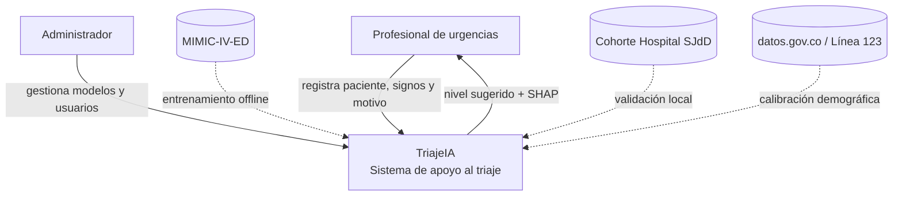
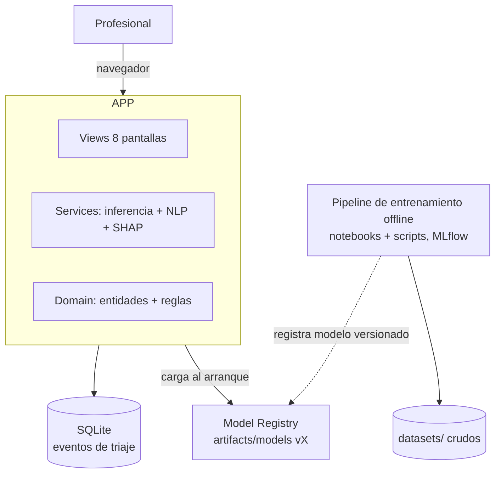
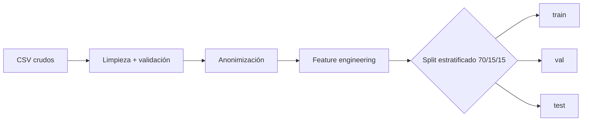
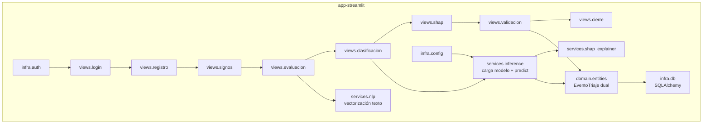
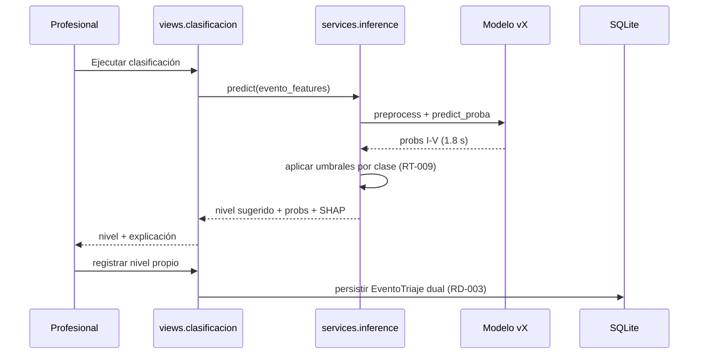
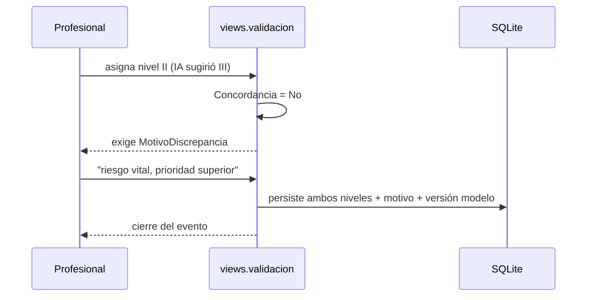
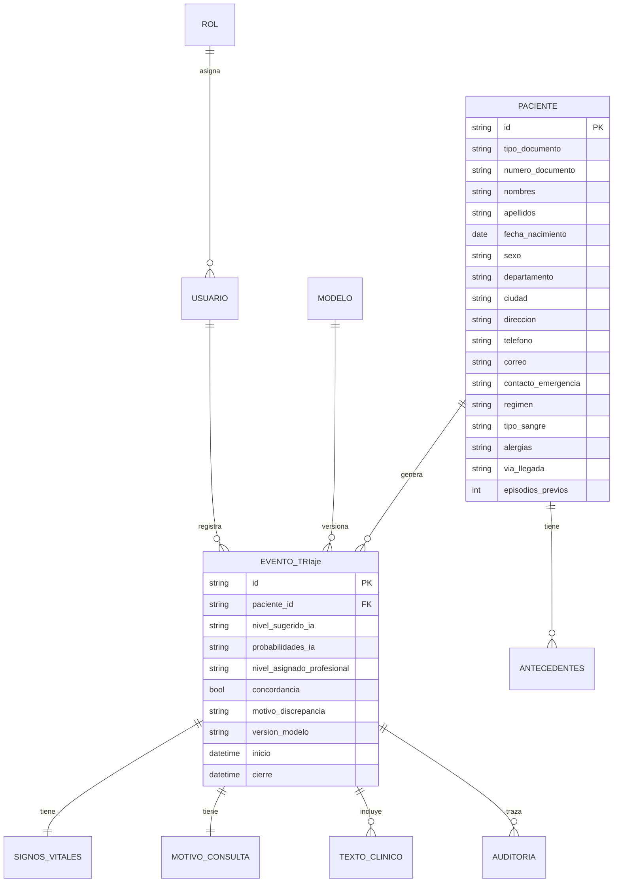
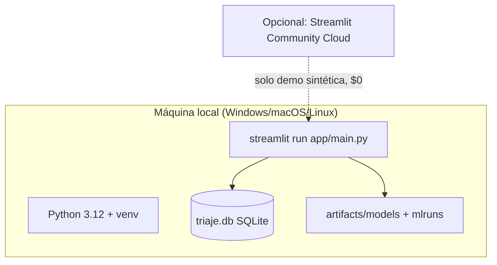

# Documento de Arquitectura de Software: TriajeIA — Sistema de Triaje Multimodal basado en IA

**Versión:** 1.0
**Fecha:** 2026-08-13
**Tipo de documento:** Arquitectura propuesta (Caso A — greenfield)
**Autor:** Generado con asistencia de IA (skill `archi`, modo ML), revisado por el equipo del TFM
**Proyecto:** TFM UNIR — "Desarrollo de un sistema de triaje multimodal basado en IA para la atención en urgencias médicas en Colombia" (Medina / Rivera / Soto, dir. Damaris Fuentes Lorenzo)

---

## 1. Introducción y Objetivos

### 1.1 Propósito del sistema

TriajeIA es un sistema de **apoyo a la decisión clínica** (no autónomo — RNF-008) que asiste al profesional de urgencias en la clasificación de pacientes según los 5 niveles de triaje de la Resolución 5596/2015 de Colombia (I Resucitación, II Emergencia ≤30 min, III Urgencia 2–4 h, IV 4–12 h, V 12–24 h — RD-001). El sistema combina datos estructurados (signos vitales, demográficos) y texto clínico libre (motivo de consulta) mediante **fusión temprana y tardía** (RT-002), emite un nivel sugerido con probabilidades por clase y una explicación SHAP, y registra de forma dual la decisión de la IA y la del profesional (RD-003) para auditar concordancia.

### 1.2 Requerimientos funcionales clave

Priorizados desde `resources/functional/requests/` (16 RF):

| Prioridad | RF | Función |
|---|---|---|
| Alta | RF-003/004/005 | Captura de signos vitales, evaluación clínica y motivo (estructurado + NLP) |
| Alta | RF-006/007 | Inferencia IA con nivel + probabilidades y umbral por clase |
| Alta | RF-009 | Explicación SHAP en lenguaje clínico |
| Alta | RF-008/010 | Gestión de modelos y concordancia dual IA vs. profesional |
| Media | RF-011/012 | Validación humana y auditoría (trazabilidad completa) |
| Media | RF-013 | Dashboard de KPIs operativos |
| Media | RF-014 | Roles y seguridad |
| Baja | RF-015/016 | Integraciones y pipeline de entrenamiento |

### 1.3 Atributos de calidad (requerimientos no funcionales)

| Atributo | Prioridad | Métrica / objetivo | Fuente |
|---|---|---|---|
| Calidad del modelo | Alta | F1 ≥ 0.82 · Precisión ≥ 0.85 · Recall ≥ 0.80 · AUC-ROC ≥ 0.87 | RNF-001 |
| Recall en clases críticas | Muy alta | Recall I + II priorizado (costo de subclasificar riesgo vital) | RNF-003 |
| Latencia de inferencia | Alta | < 3 s end-to-end en la demo | RNF-002 |
| Disponibilidad | Media | Modo degradado: la app sigue usable sin IA (triaje manual) | RNF-009 |
| Trazabilidad | Alta | Cada evento persiste input, versión de modelo, output y decisión humana | RNF-007 |
| Privacidad | Muy alta | Anonimización obligatoria (Ley 1581/2012) | RNF-006 |

### 1.4 Interesados (stakeholders)

- **Profesionales de urgencias** (usuarios finales de la demo).
- **Tribunal/directora del TFM** (evalúa rigor científico y funcionalidad).
- **Autores del TFM** (desarrollan, entrenan y documentan).
- **Comité de Ética / Hospital San Juan de Dios** (autoriza y custodia los datos del cohorte).

## 2. Restricciones

| Restricción | Detalle | Fuente |
|---|---|---|
| Normativa | Ley 1581/2012 (datos personales) + Resolución 5596/2015 (niveles y tiempos de triaje) + Art. 2.7 UNIR (autorización de Comité de Ética para datos clínicos) | RNF-006, RD-001 |
| Stack decidido | Python + Streamlit para la demo funcional (decisión cerrada por `refinador`, IA 14/100) | RT-001, RT-007 |
| Alcance demo | Datos sintéticos calibrados con distribuciones reales para la demo; datos reales solo en el pipeline offline de investigación | Refinador 2026-08-13 |
| Fuentes de datos | MIMIC-IV-ED (credencializada, pendiente CITI), cohorte Hospital San Juan de Dios (autorizado), datos.gov.co, Línea 123 Bogotá | RT-006 |
| Presupuesto | $0 en infraestructura (entorno académico, ejecución local) | Contexto TFM |
| Plazo | Predepósito 14/07/2026 · depósito según calendario UNIR | Contexto TFM |
| Sin modo "a ciegas" | Fuera de alcance en esta iteración (decisión refinador) | RT-007 |

## 3. Alcance y Contexto del Sistema

### 3.1 Contexto de negocio

Actores externos: profesional de salud (valida y decide), paciente (fuente de datos, nunca usuario directo del sistema), administrador (gestiona modelos y usuarios). Sistemas externos: datasets de investigación (MIMIC, Socrata), futuro HIS hospitalario (integración RF-015 — solo definida, no implementada en la demo).

### 3.2 Diagrama de Contexto (C4 Nivel 1)

> **Diagrama oficial:** `Diagramas_TriajeIA.drawio` → pestaña **1. C1 Contexto**. El Mermaid es equivalente textual.

## 4. Estrategia de Solución

### 4.1 Por qué ML y no reglas deterministas

Las escalas clínicas (MTS, ESI) son reglas expertas estáticas; el proyecto evalúa si un modelo multimodal supera o complementa esa cota (benchmark de literatura, RT-008). El ML se justifica por: (a) patrón de decisión de alta dimensión (signos + texto + demografía), (b) objetivo de investigación del TFM (comparar fusión temprana vs. tardía), (c) existencia de datasets reales etiquetados. La responsabilidad se divide: **el modelo sugiere** (nivel + probabilidades + explicación), **las reglas clínicas y el profesional deciden** — el sistema nunca autocompleta el nivel del profesional (RD-003).

### 4.2 Arquitecturas candidatas evaluadas (Paso 0.9 de `archi`)

**Drivers:** 1º entrega de demo funcional en semanas, 2º reproducibilidad y trazabilidad científica, 3º costo $0, 4º experiencia de uso en demo, 5º extensibilidad futura.

| Criterio (peso) | A: Monolito Streamlit + SQLite + modelo empaquetado | B: React + FastAPI + PostgreSQL + serving dedicado | C: FastAPI + Streamlit (2 contenedores) |
|---|---|---|---|
| Entrega rápida (30%) | 5 | 2 | 3 |
| Reproducibilidad (25%) | 5 | 4 | 4 |
| Costo (20%) | 5 | 3 | 4 |
| UX demo (15%) | 4 | 5 | 4 |
| Extensibilidad (10%) | 3 | 5 | 4 |
| **Ponderado** | **4.70** | 3.45 | 3.70 |

**Decisión: Candidata A.** La demo es mono-usuario, académica y de alcance acotado; un backend separado o un serving dedicado agregan complejidad sin beneficio medible para los drivers. La extensibilidad se preserva aislando la lógica de dominio y el motor de inferencia en módulos independientes (Sección 6), de modo que migrar a FastAPI/React sea evolutivo, no un rewrite.

### 4.3 Estrategia de solución

**Monolito modular Streamlit** (patrón Layered + Services): capas `views` (pantallas), `domain` (entidades y reglas), `services` (inferencia, NLP, validación), `infra` (BD, auth, configuración). El modelo se empaqueta como artefacto versionado (`joblib`/ONNX + registro MLflow) y se carga en memoria al iniciar la app (latencias < 3 s, RNF-002).

## 5. Vista de Contenedores (C4 Nivel 2)

> **Diagrama oficial:** `Diagramas_TriajeIA.drawio` → pestaña **2. C2 Contenedores**.

| Contenedor | Tecnología | Responsabilidad | Por qué |
|---|---|---|---|
| `app-streamlit` | Python 3.12 + Streamlit | UI + orquestación del flujo de triaje + inferencia en proceso | Único framework decidido (RT-007); entrega rápida; <3 s sin salto de red |
| `triaje-db` | SQLite (SQLAlchemy ORM) | Persistencia local de eventos, auditoría y usuarios | Cero configuración, mono-usuario, datos demo sintéticos; migrable a PostgreSQL (ADR-002) |
| `model-registry` | Directorio `artifacts/models/` + MLflow (local) | Modelos versionados + metadatos de corrida | Reproducibilidad científica (RT-005) |
| `training-pipeline` | Python (pandas, scikit-learn, XGBoost, transformers) | Entrenamiento/evaluación offline | No forma parte del runtime de la demo (Sección 5.2) |

### 5.1 Arquitectura de Datos

> **Diagrama oficial:** `Diagramas_TriajeIA.drawio` → pestaña **6. ML C2 Pipeline** (pipeline de datos completo).

| Fuente | Tipo | Volumen | Rol | Sensibilidad |
|---|---|---|---|---|
| MIMIC-IV-ED | Tabular + texto libre | ~425k visitas (ED), estático | Preentrenamiento / baseline | Credencial PhysioNet + CITI |
| Cohorte Hospital San Juan de Dios | Tabular (morbilidad + etiqueta triaje) | 43.594 episodios | Validación contexto local | Datos de salud — anonimizados, autorización vigente |
| datos.gov.co — triaje nacional | Tabular | 89.453 eventos | Calibración de distribución I–V | Pública |
| BDUA (contributivo/subsidiado) | Tabular | ~11 M registros | Perfil demográfico | Pública |
| Línea 123 Bogotá | Texto (llamadas) | ~100 meses | NLP motivo de consulta | Pública |
| Datos sintéticos demo | Tabular + texto | Generados | Demo funcional | Sintéticos, calibrados con distribuciones reales |

Pipeline (13 pasos, RD-006): ingesta CSV → limpieza/validación → anonimización (Ley 1581) → feature engineering (normalización, one-hot, embeddings de texto) → split **estratificado por nivel** 70/15/15 con **semilla fija** (evita leakage: split previo a cualquier fit; el texto se vectoriza con un modelo preentrenado, sin reentrenar con el test).

### 5.2 Arquitectura de Entrenamiento

> **Diagramas oficiales:** `Diagramas_TriajeIA.drawio` → pestañas **5. ML C1 Contexto**, **6. ML C2 Pipeline** y **7. Arquitectura del Modelo**.

1. **Baselines (obligatorios, RT-004):** Regresión Logística y Random Forest solo con datos estructurados; XGBoost como baseline fuerte. Ningún modelo complejo se acepta sin superar esta cota con significancia estadística.
2. **Submodelo de texto:** BERT clínico en español (BETO / biomédico), embeddings del motivo de consulta (RT-003).
3. **Fusión:** temprana (concatenación de features + clasificador único) y tardía (probabilidades por submodelo combinadas con meta-modelo de Regresión Logística — RT-010). Ambas se entrenan y comparan (requisito del TFM).
4. **Hiperparámetros:** Optuna (búsqueda bayesiana), métrica objetivo F1-macro con recall ponderado en clases I–II.
5. **Tracking:** MLflow local (`mlruns/`) registra parámetros, métricas, artefactos y semillas; **DVC** o convención de nombres versiona los datasets (`data-v<fecha>-<hash>`).
6. **Cómputo:** CPU local del equipo (los modelos y el volumen lo permiten); sin GPU requerida.
7. **Umbrales por clase:** ajuste de thresholds por nivel optimizando recall I–II (RT-009, RNF-003), no solo argmax.

### 5.3 Evaluación y Métricas

| Métrica | Meta (RNF-001) | Global | Por clase I–V (obligatorio) |
|---|---|---|---|
| F1-score | ≥ 0.82 | reportar | reportar todas |
| Precisión | ≥ 0.85 | reportar | reportar |
| Recall | ≥ 0.80 | reportar | **prioridad en I y II** |
| AUC-ROC | ≥ 0.87 | one-vs-rest | curva por nivel |

Además: matriz de confusión 5×5 del modelo ganador, comparación contra baselines con test estadístico (McNemar entre pares), comparación contra benchmark de literatura MTS/ESI (RT-008) y contra la distribución real nacional (RNF-004). **Desbalance** (real: III 88.5%, IV 7.8%, II 3.0%, V 0.5%, I 0.2% — RNF-004): class weights + threshold tuning; SMOTE se evalúa pero no es default (ADR-003).

### 5.4 Explicabilidad (XAI)

- **Técnica:** SHAP — TreeExplainer para XGBoost, KernelExplainer para el meta-modelo de fusión tardía, SHAP de transformers para el submodelo de texto (HU-E4-02).
- **Contrato con el usuario:** top-N variables traducidas a lenguaje clínico ("La saturación de O₂ baja (88 %) fue el factor de mayor peso") + comparación implícita con criterios MTS; impactos +/− diferenciados (mockups `s-shap`).
- **Alcance:** local (explicación por evento) + global (importancia agregada en Dashboard/Gestión de modelos, fase 2).

## 6. Vista de Componentes (C4 Nivel 3 — contenedor `app-streamlit`)

> **Diagrama oficial:** `Diagramas_TriajeIA.drawio` → pestaña **3. C3 Componentes**.

Los componentes de dominio (`domain/`) no dependen de Streamlit — esa frontera es la que permitirá evolucionar a FastAPI+React sin reescribir lógica (Candidata B).

## 7. [Opcional] Vista de Código

> **Diagrama oficial:** `Diagramas_TriajeIA.drawio` → pestaña **4. C4 Código (clases clave)** — clases del dominio e inferencia. Los diagramas de secuencia equivalentes están en las pestañas 9 y 10 del mismo archivo.

## 8. Vistas de Ejecución: Diagramas de Secuencia

### 8.1 Flujo crítico 1 — Inferencia end-to-end (HU-E4-01, RNF-002 < 3 s)

> **Diagrama oficial:** `Diagramas_TriajeIA.drawio` → pestaña **9. Secuencia Inferencia**.

### 8.2 Flujo crítico 2 — Discrepancia con motivo obligatorio (HU-E4-03, RD-003)

> **Diagrama oficial:** `Diagramas_TriajeIA.drawio` → pestaña **10. Secuencia Validación (discrepancia)**.

## 9. Modelo de Datos

Estrategia de persistencia (Paso 0.8 de `archi`): datos **transaccionales** de bajo volumen, mono-usuario, demo local → **SQLite** con ORM SQLAlchemy (patrón de acceso: escrituras puntuales + lecturas de auditoría; sin concurrencia real). PostgreSQL queda documentado como evolución natural si la demo escala a multi-usuario o despliegue hospitalario (ADR-002).

Campos del paciente: 11 decididos por `refinador` (9 demográficos + TipoSangre + Alergias, RD-002). Esquema dual de `EventoTriaje` según RD-003. Entidades restantes del catálogo (ENT-006, ENT-007, ENT-010 a ENT-012) se mapean a `EvaluacionClinica`, `Concordancia` (embebida en el evento), `ConfiguracionUmbrales`, `RegistroTriaje` (vista de export PDF) — ver Supuestos.

### 9.1 Arquitectura de Inferencia / Servicio del Modelo

| Decisión | Valor |
|---|---|
| Modo | Tiempo real, síncrono, **en proceso** dentro de Streamlit |
| Ubicación del modelo | `artifacts/models/<algo>_v<fecha>.joblib` (+ metadatos MLflow), cargado al arranque |
| Latencia objetivo | < 3 s (RNF-002); medido en demo: 1.8 s |
| Reentrenamiento | Manual bajo demanda (investigación) — no hay deriva automática en alcance demo |

## 10. Conceptos Transversales

| Concepto | Resolución |
|---|---|
| Autenticación | Login local por correo + contraseña con hash (bcrypt); token simulado por email para recuperación (demo, refinador). Bloqueo 3 intentos/15 min (HU-E1-04). |
| Autorización | Roles `Profesional` y `Administrador` (RF-014); demo mono-rol en la práctica |
| Manejo de errores | Formato único `{error: {codigo, mensaje, detalle}}`; modo degradado sin IA (RNF-009) |
| Logging | `logging` estándar + formato estructurado (JSON), niveles DEBUG/INFO/WARNING |
| Configuración/secrets | `.env` + `python-dotenv`; nunca secretos en código (RT-005) |
| Validación | En el límite de entrada (formularios de Streamlit) + rangos clínicos por edad (RD-002) |
| Anonimización | Los datos de la demo son sintéticos; en el pipeline offline, anonimización previa a todo procesamiento (RNF-006) |
| Reproducibilidad | Semillas fijas, MLflow, convención de versionado de datos `data-v<fecha>` |

## 11. Decisiones Arquitectónicas (ADRs)

### ADR-001: Monolito Streamlit sobre frontend/backend separados
- **Contexto:** demo académica mono-usuario, plazo acotado, decisión de stack ya tomada en refinador (RT-007).
- **Decisión:** monolito modular Streamlit con capas aisladas (Sección 6).
- **Alternativas:** React+FastAPI (desechada por costo de entrega), FastAPI+Streamlit (desechada por complejidad sin beneficio).
- **Consecuencias:** +velocidad de entrega, +simplicidad; −acoplamiento UI/lógica a mediano plazo (mitigado con frontera `domain/` pura).

### ADR-002: SQLite para la demo, PostgreSQL como evolución
- **Contexto:** persistencia transaccional de eventos con cero infraestructura.
- **Decisión:** SQLite vía SQLAlchemy ORM; el ORM abstrae el motor.
- **Consecuencias:** +arranque instantáneo, +costo $0; −sin concurrencia multi-usuario real (trigger de reevaluación: despliegue hospitalario).

### ADR-003: Manejo de desbalance con class weights + umbrales (no SMOTE por defecto)
- **Contexto:** distribución real extrema (III 88.5% vs. I 0.2%, RNF-004) y recall prioritario en I–II.
- **Decisión:** class weights en entrenamiento + ajuste de umbrales por clase; SMOTE como experimento controlado.
- **Consecuencias:** +control fino del recall crítico; −riesgo de sobreajuste con SMOTE evitado.

### ADR-004: Fusión tardía como candidata principal (comparada con temprana)
- **Contexto:** RT-002 exige comparar ambas fusiones.
- **Decisión:** entrenar ambas; la tardía (meta-modelo LR) es la candidata principal por modularidad y explicabilidad.
- **Consecuencias:** +interpretabilidad por submodelo; −dos pipelines a mantener (costo asumido: es el objeto de estudio del TFM).

## 12. Vista de Despliegue

> **Diagrama oficial:** `Diagramas_TriajeIA.drawio` → pestaña **8. Despliegue**.

Sin proveedor cloud definido en las especificaciones y con alcance académico: el despliegue es **local** (no aplica comparativo multi-nube productivo — ver Supuestos).

- **Ambiente:** un solo entorno local; `pip install -r requirements.txt`.
- **Cómputo de entrenamiento:** misma máquina local (CPU), separado del runtime.
- **Comunidad Cloud:** opción de publicación $0 para la defensa; nunca con datos reales (RNF-006).

## 13. Riesgos y Deuda Técnica

| Riesgo | Impacto | Mitigación |
|---|---|---|
| Desbalance extremo I/II | Modelo que "acierta" prediciendo III | Métricas por clase + umbrales + recall I–II (ADR-003) |
| Training-serving skew | Métricas infladas offline | Feature engineering versionado como función compartida, no ad hoc |
| Dataset internacional vs. contexto colombiano | Sesgo de población | Validación con cohorte local (43.594) + calibración nacional (RNF-004) |
| Acceso a MIMIC pendiente (CITI) | Retraso de preentrenamiento | Baselines con datos locales ya disponibles; MIMIC como mejora |
| Deriva no monitoreada | Degradación silenciosa | Estrategia prevista: monitor de distribución de features (fase 2) |
| Deuda: 4 pantallas de soporte diferidas | Demo incompleta en admin | Fase 2 explícita en el plan |

### 13.1 Gobernanza, Ética y Cumplimiento

- **Rol del sistema:** apoyo a la decisión humana — el nivel del profesional es obligatorio y prevalece; la IA nunca lo autocompleta (RNF-008, RD-003).
- **Marco normativo:** Ley 1581/2012 (protección de datos personales) + Resolución 5596/2015; datos clínicos solo con autorización del Comité de Ética (Art. 2.7 UNIR). La demo usa exclusivamente datos sintéticos.
- **Sesgo/representatividad:** documentado como limitación explícita si el entrenamiento se basa en MIMIC (EE. UU.) sin adaptación local.
- **Trazabilidad:** cada predicción persiste input relevante, versión de modelo, output y decisión humana (RD-003, RF-013) — habilita auditoría y análisis de discrepancias.
- **Deriva:** estrategia documentada (Sección 13), implementación en fase 2.

## 14. [Caso C] Gap Analysis — No aplica (Caso A).

## 15. [Caso C] Roadmap — No aplica. Roadmap natural del proyecto: `genesis` → `builder` (HU en orden del flujo clínico) → `validacion-cientifica-ml` → `tfm-redactor`.

## 16. Supuestos

1. **Entidades ENT-006, ENT-007, ENT-010–ENT-012:** nombres y campos inferidos desde los RF/RD disponibles (el catálogo original remite a `CONTEXT TRIA.txt`); validar con negocio antes del primer `builder` de esos recursos.
2. **SQLite** elegido para la demo; PostgreSQL si el sistema deja de ser demo.
3. **Autenticación local** (bcrypt + token simulado) — no hay proveedor de identidad externo en alcance.
4. **No hay despliegue productivo:** el alcance del TFM es la demo funcional + modelo evaluado offline; por eso la Sección 12 no desarrolla comparativo multi-nube ni Pricing (lo exige `archi` solo para despliegue productivo).
5. **Datos sintéticos** de la demo calibrados con las distribuciones reales validadas (RNF-004).
6. **Monorepo:** el código de la aplicación se inicializará en la carpeta `triaje-ia/` del repositorio Kit-IA (el kit aloja múltiples proyectos y no debe mezclarse con el código de la app).

## 17. Glosario

| Término | Definición |
|---|---|
| Triaje | Clasificación de pacientes por prioridad clínica (Res. 5596/2015) |
| MTS / ESI | Escalas de triaje Manchester / Emergency Severity Index (benchmarks) |
| Fusión temprana / tardía | Combinar modalidades a nivel de features vs. a nivel de decisiones |
| SHAP | SHapley Additive exPlanations — explicabilidad de predicciones |
| RIPS / BDUA | Registros de prestación de servicios / Base de datos de afiliados (Colombia) |
| Training-serving skew | Divergencia entre features de entrenamiento y producción |
