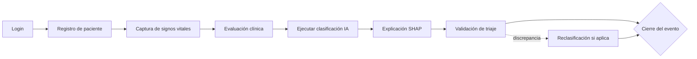

# RD-005: Flujo Principal de la Demo

**Tipo:** Información de diseño
**Fuente:** `context/04-ESPECIFICACION-APLICACION-DEMO.md` §4 · `context/06-CAPTURA-SINTOMAS-Y-COMPARATIVA-IA-PROFESIONAL.md` §3

## Descripción
Flujo clínico principal para prototipos click-through:

## Detalle del paso "Ejecutar clasificación IA" (06 §3)

1. Captura de síntomas/motivo (texto libre + categoría estructurada).
2. El sistema ejecuta el modelo con síntomas + signos vitales + resto de variables.
3. Se muestra: nivel sugerido + probabilidades por nivel + SHAP.
4. El profesional registra **su propia** clasificación (campo propio, obligatorio).
5. Coinciden → Concordancia = Sí; difieren → motivo de discrepancia obligatorio.
6. Cierre del evento con ambos valores persistidos.

## Pantallas de soporte (fuera del flujo principal)
Comparación de modelos, Gestión de modelos, Dashboard, Auditoría — diseñar después del flujo principal.
