# RD-006: Pipeline Técnico de Entrenamiento y Evaluación

**Tipo:** Información de diseño
**Fuente:** `context/02-ESPECIFICACION-TECNICA-MODELOS-IA.md` §5 · `context/CONTEXTO TRIAJE.txt` §5

## Descripción
Secuencia de 13 pasos del pipeline offline:

```mermaid
flowchart LR
    A[1. Ingesta] --> B[2. Anonimización]
    B --> C[3. Limpieza: nulos/outliers]
    C --> D[4. Normalización / one-hot]
    D --> E[5. Embeddings de texto]
    E --> F[6. Split + 10-fold CV]
    F --> G[7. Baselines unimodales]
    G --> H[8. Early y Late fusion en paralelo]
    H --> I[9. Threshold tuning I-II]
    I --> J[10. Evaluación por nivel + AUPRC]
    J --> K[11. SHAP sobre ganador]
    K --> L[12. Comparación vs benchmarks]
    L --> M[13. Despliegue en demo]
```

## Notas de diseño
- Paso 2 (anonimización) es obligatorio antes de cualquier paso posterior.
- Paso 8 entrena ambas arquitecturas; la selección usa Recall en I–II (RNF-003).
- Paso 12 usa los benchmarks de RT-008.
- La v2.0 del documento de contexto numera 12 pasos (fusiona ingesta+anonimización en limpieza); la secuencia es equivalente.
