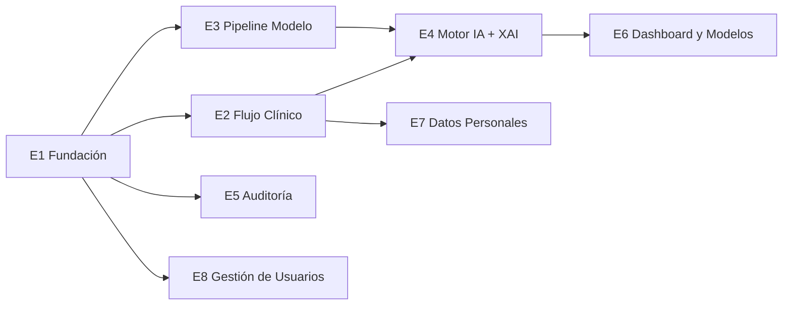

# Desglose de Épicas — Sistema de Triaje Multimodal IA (TFM UNIR)

**Fuente:** `resources/datos/functional/reqs/epicas-tfm-jira.csv` (E1-E6) + `resumen-cambios-pendientes.md` (E7) + HU de gestión de usuarios (E8)
**Fecha:** 2026-08-13 · **Método:** skill `desglosador` · **Salida:** `resources/functional/hu/` (un .md por HU/TT)

## Supuestos explícitos (ambigüedades detectadas en las épicas)

1. **Streamlit — decisión cerrada** (refinador, 2026-08-13, IA 14/100; ver `001-decisiones-demo-triaje-ia.md`). Flask queda documentado como alternativa.
2. **[SUPUESTO] Python 3.12** como versión concreta de "Python 3.10+".
3. **[SUPUESTO] Recuperación de contraseña por email:** en la demo se simula (sin SMTP real); se documenta el punto de extensión.
4. **[SUPUESTO] TLS/HTTPS en demo local:** self-signed o deshabilitado en local; el cifrado en reposo se documenta aunque los datos demo sean sintéticos.
5. **[SUPUESTO] Método late fusion:** promedio ponderado por defecto; stacking y meta-clasificador como experimentos de Fase 3 (RT-010).
6. **Datos demo confirmados:** sintéticos (~100-200 pacientes) generados con las distribuciones reales validadas (RNF-004: III 88,5 % / I 0,2 %) y los datasets cargados en `datasets/`.

## Estructura general

| Épica | Contenido | Issues |
|---|---|---|
| E1 Fundación | Stack, BD/dominio ENT-001..012, seguridad, roles | 8 (4 TT + 4 HU) |
| E2 Flujo Clínico | 7 pantallas, signos vitales, estados del triaje | 8 HU |
| E3 Pipeline Modelo | 13 pasos offline, early+late fusion, métricas | 9 TT |
| E4 Motor IA + XAI | Inferencia, SHAP, concordancia IA-profesional | 5 (1 TT + 4 HU) |
| E5 Auditoría | Registros inmutables, exportación, registro normativo | 3 (1 TT + 2 HU) |
| E6 Dashboard y Modelos | KPIs, versionado, comparación | 3 HU |
| E7 Datos Personales | 9 campos de paciente + catálogos Colombia | 4 (3 TT + 1 HU) |
| E8 Gestión de Usuarios | CRUD de usuarios | 3 HU |

**Total: 43 issues (18 TT + 25 HU).**

## Dependencias entre épicas

## Mapa RF janus → issues

| RF janus | Issues que lo implementan |
|---|---|
| RF-001 Gestión de Pacientes | HU-E2-01, HU-E2-02, HU-E2-03, HU-E7-01, TT-E7-* |
| RF-002 Evento de Triaje | HU-E2-06, HU-E2-08, HU-E2-07 |
| RF-003 Signos Vitales | HU-E2-04 |
| RF-004 Evaluación Clínica | HU-E2-05 |
| RF-005 NLP | TT-E3-03 |
| RF-006/007 Inferencia y umbral | HU-E4-01, TT-E3-07 |
| RF-008 Gestión de Modelos | HU-E6-02, HU-E4-04 |
| RF-009 SHAP | HU-E4-02, TT-E3-08 |
| RF-010 Concordancia dual | HU-E4-03, HU-E2-08 |
| RF-011 Validación humana | HU-E2-07, HU-E4-03 |
| RF-012 Auditoría | TT-E5-01, HU-E5-01 |
| RF-013 Dashboard | HU-E6-01, HU-E6-03 |
| RF-014 Seguridad/Roles | HU-E1-01..04, TT-E1-03, HU-E8-* |
| RF-015 Integraciones | TT-E1-04 (puntos HCE) |
| RF-016 Pipeline offline | TT-E3-01..09 |
