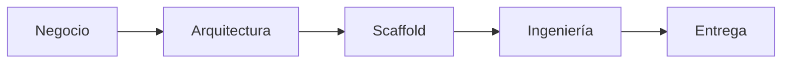

# Pipeline SDD — de RFP a producción

## Fase 1 — Negocio

| Skill | Rol |
|---|---|
| [[janus]] | Extrae requerimientos (RF, RNF, RT, RD) de RFP/TDR |
| [[refinador]] | Refina necesidades ambiguas (IA ≤ 15) |
| [[desglosador]] | Descompone épicas Jira en HU/TT |
| [[figma-prd-mockups]] | Mockups de pantallas antes de codificar |
| [[front]] | Dirección visual distintiva (paleta, tipografía) |

## Fase 2 — Arquitectura

| Skill | Rol |
|---|---|
| [[archi]] | Documento de arquitectura, C4, multi-nube + pricing, ADRs |

## Fase 3 — Scaffold

| Skill | Rol |
|---|---|
| [[genesis]] | Bootstrap greenfield: capas, plomería, DI, health check |
| [[builder]] | Scaffold de módulos de dominio (CRUD, ML, CLI, mobile) |

## Fase 4 — Ingeniería

| Skill | Rol |
|---|---|
| [[tdd-implementacion]] | Lógica de negocio en slices con Red-Green-Refactor |
| [[qa]] | E2E (Playwright), evidencia en video, runbooks |
| [[revision-calidad]] | Review de 5 ejes antes de merge |
| [[seguridad-rendimiento]] | OWASP Top 10 + presupuestos de performance |
| [[documentacion-observabilidad]] | ADRs + logs estructurados, métricas RED, trazas |

## Fase 5 — Entrega

| Skill | Rol |
|---|---|
| [[entrega-continua]] | Commits atómicos, CI/CD, release con rollback |

## Transversales

- [[orquestador]] — router: decide qué skill(es) aplican
- [[memoria]] — estado entre sesiones (`resources/session/`)
- [[obsidian]] — exportación a vaults
- [[mcp-builder]] — servidores MCP en Python/TS
- Documentos: [[docx]], [[pdf]], [[pptx]], [[xlsx]]

## Académicos (TFM/ML)

- [[validacion-cientifica-ml]] — rigor científico del pipeline ML
- [[tfm-redactor]] — redacción de capítulos TFM (normativa UNIR)

## Contrato de recursos

Ver [[kit/Contrato-Resources]].
