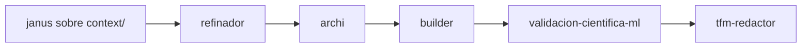

# 🎓 MOC — TFM Triaje IA (UNIR)

**Título:** Desarrollo de un sistema de triaje multimodal basado en IA para la atención en urgencias médicas en Colombia
**Autores:** Medina Betancur, D. · Rivera Villanueva, L. · Soto Díaz, E.
**Directora:** Damaris Fuentes Lorenzo
**Estado:** Predepósito (Ordinaria) — 14/07/2026

## Documentos de contexto (`context/`)

- [[tfm-triaje/brief_finalizacion_tfm|Brief de finalización]] — briefing operativo con reglas UNIR
- [[tfm-triaje/00-validacion-hallazgos|00 · Validación de hallazgos]]
- [[tfm-triaje/01-contexto-maestro|01 · Contexto maestro consolidado]]
- [[tfm-triaje/02-especificacion-tecnica-modelos|02 · Especificación técnica de modelos IA]]
- [[tfm-triaje/03-catalogo-datos|03 · Catálogo de datos y variables]]
- [[tfm-triaje/04-especificacion-app-demo|04 · Especificación de la app demo]]
- [[tfm-triaje/07-mapeo-descarga-datasets|07 · Mapeo y descarga de datasets]]

## Datos

- [[datasets-privacidad]] — ⚠️ advertencia de privacidad (datos clínicos reales)

## Skills del kit aplicables

- [[janus]] → extraer requerimientos del brief
- [[archi]] → arquitectura del sistema multimodal
- [[builder]] → scaffold del pipeline ML
- [[validacion-cientifica-ml]] → rigor científico antes de declarar resultados
- [[tfm-redactor]] → redactar capítulos depositables

## Pipeline sugerido

